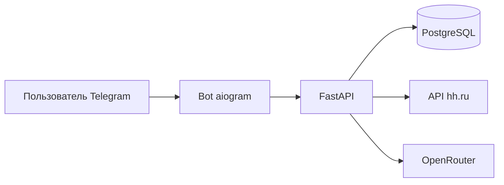

# HH AI Agent

**Умный поиск работы на hh.ru в Telegram** — вакансии с AI-оценкой под твоё резюме, фильтры по уровню и зарплате, готовые сопроводительные письма.

---

## Что умеет

| Возможность | Описание |
|-------------|----------|
| **Поиск с фильтрами** | Уровень (Junior / Middle / Senior), опыт, удалёнка, город, зарплата |
| **AI-анализ** | Match-score, плюсы и минусы, рекомендация «откликаться или нет» |
| **Сопроводительные** | Генерация и улучшение письма под вакансию |
| **Тарифы** | Free и Pro с лимитами на поиск и письма |
| **Дайджест** | Утренняя подборка вакансий по последнему запросу (9:00 МСК) |
| **Рефералы** | «Приведи друга» — бонусные поиски |
| **Оплата Pro** | ЮKassa (webhook) или промокод / ручная активация |
| **Лендинг** | Страница `/welcome` для рекламы |

> Автоотклик и синхронизация резюме через API соискателя hh.ru **недоступны** — с декабря 2024 hh не выдаёт токен соискателя сторонним приложениям. Отклик — вручную по ссылке на вакансию.

---

## Стек

- **Backend:** FastAPI, SQLAlchemy, PostgreSQL / SQLite  
- **Bot:** aiogram 3  
- **AI:** OpenRouter (GPT / Gemini и др.)  
- **Вакансии:** официальный API hh.ru (app token)  
- **Деплой:** Docker Compose, Caddy, Timeweb / Render  

---

## Быстрый старт (Docker)

### 1. Клонирование и настройка

```bash
git clone https://github.com/ScandicCon/hh-ai.git
cd hh-ai
cp .env.example .env
```

Заполни `.env` (см. [`.env.example`](.env.example)). **Файл `.env` в Git не коммитится.**

### 2. Запуск

```bash
docker compose up -d --build
```

| Сервис | Назначение |
|--------|------------|
| `db` | PostgreSQL 16 |
| `api` | FastAPI → http://localhost:9090 |
| `bot` | Telegram-бот |

Проверка API:

```bash
curl http://127.0.0.1:9090/health
```

Лендинг: [http://127.0.0.1:9090/welcome](http://127.0.0.1:9090/welcome)

### 3. Локально без PostgreSQL

```bash
docker compose -f docker-compose.sqlite.yml up -d --build
```

---

## Запуск на Windows (без Docker)

```powershell
cd hh.ai
python -m venv venv
.\venv\Scripts\pip install -r requirements.txt
copy .env.example .env
# заполни .env

.\run_backend.ps1   # терминал 1
.\run_bot.ps1       # терминал 2
```

Если Telegram не открывается без VPN, в `.env`:

```env
TELEGRAM_PROXY=socks5://127.0.0.1:10808
```

---

## Переменные окружения

| Переменная | Обязательно | Описание |
|------------|-------------|----------|
| `BOT_TOKEN` | да | Токен от [@BotFather](https://t.me/BotFather) |
| `OPENROUTER_API_KEY` | да | Ключ [OpenRouter](https://openrouter.ai) |
| `ADMIN_TELEGRAM_IDS` | да | Твой Telegram ID ([@userinfobot](https://t.me/userinfobot)) |
| `ADMIN_API_KEY` | да | Секрет для админ-API |
| `BOT_USERNAME` | да | Имя бота без `@` |
| `HH_CLIENT_ID` / `HH_CLIENT_SECRET` | да | Приложение на [dev.hh.ru](https://dev.hh.ru) |
| `POSTGRES_PASSWORD` | Docker | Пароль БД на сервере |
| `PUBLIC_URL` | прод | `https://api.твой-домен.ru` для webhook ЮKassa |
| `YOOKASSA_*` | опционально | Автооплата Pro |
| `TELEGRAM_PROXY` | локально | Прокси к Telegram; на VPS — пусто |

Полный список — в [`.env.example`](.env.example).

---

## Тарифы

| | Free | Pro |
|---|:---:|:---:|
| Поисков в неделю | 5 | 100 |
| Сопроводительных в неделю | 1 | 50 |

Активация Pro: оплата через бота, промокод `/promo КОД`, команда админа `/activate_pro ID`.

---

## Как пользоваться ботом

1. `/start` → отправь **резюме текстом**  
2. **Искать вакансии** → запрос (например, `Python backend`)  
3. Выбери фильтры → **Искать**  
4. Под вакансией: **Подробнее**, **Сопроводительное**, **Отклик на hh.ru**

**Команды:** `/plan` · `/search` · `/resume` · `/invite` · `/analyses` · `/promo КОД`

---

## Деплой в прод

| Платформа | Инструкция |
|-----------|------------|
| **Timeweb VPS** (рекомендуется) | [`docs/DEPLOY_TIMEWEB.md`](docs/DEPLOY_TIMEWEB.md) |
| Пошагово с нуля | [`docs/DEPLOY_GUIDE.md`](docs/DEPLOY_GUIDE.md) |
| Render | [`docs/DEPLOY_RENDER.md`](docs/DEPLOY_RENDER.md) |
| Общее | [`DEPLOY.md`](DEPLOY.md) |

Кратко на сервере:

```bash
git clone <repo> /opt/hh-ai && cd /opt/hh-ai
cp .env.example .env && nano .env
docker compose up -d --build
```

---

## Структура проекта

```
hh.ai/
├── app/                 # FastAPI: API, AI, hh.ru, платежи
│   ├── routers/         # vacancies, subscription, payments, …
│   ├── services/        # job_agent, hh_service, search_filters
│   └── static/          # лендинг /welcome
├── bot/                 # Telegram: handlers, keyboards, digest
├── docs/                # деплой и интеграции
├── docker-compose.yml   # API + bot + PostgreSQL
├── .env.example         # шаблон (в Git)
└── .env                 # секреты (только локально / на сервере)
```

---

## API (основное)

| Метод | Путь | Описание |
|-------|------|----------|
| `GET` | `/health` | Проверка сервиса и БД |
| `GET` | `/welcome` | Лендинг |
| `POST` | `/vacancies/best/{profile_id}` | Поиск + AI-анализ |
| `POST` | `/vacancies/cover-letter/{analysis_id}` | Сопроводительное |
| `POST` | `/payments/yookassa/webhook` | Webhook оплаты |

---

## Архитектура



---

## Документация

- [`docs/HH_CONNECT.md`](docs/HH_CONNECT.md) — ограничения OAuth hh.ru  
- [`docs/ETAP3_DEPLOY.md`](docs/ETAP3_DEPLOY.md) — чеклист продакшена  
- [`MARKETING.md`](MARKETING.md) — идеи для продвижения  

---

## Лицензия и ответственность

Проект использует официальный API hh.ru. AI даёт рекомендации, а не гарантию трудоустройства. Резюме и персональные данные хранятся на твоём сервере — соблюдай 152-ФЗ и политику конфиденциальности для пользователей.

---

<p align="center">
  <sub>Сделано для тех, кто устал бесконечно скроллить hh.ru</sub>
</p>
